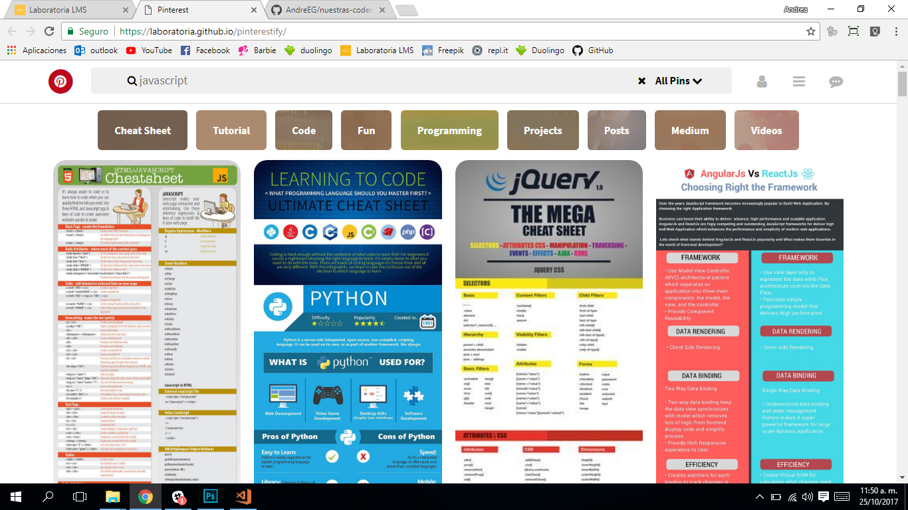

# CLASE PRÁCTICA
## Replicar el siguiente ejercicio


### HTML
Lo primero a realizar es la maquetación HTML la cual tendra un HEADER que consta de un menu y submenu y un SECTION el cual tendra todas las imagenes en su interior.

```
		
	//<body>
        <header>
        <ul></ul>
        <hr>
        <ul></ul>
        </header>

        <section>
            <div>IMAGEN1</div>
            ...
            <div>IMAGEN18</div>
        </section>
    </body>
		
```
### CSS
